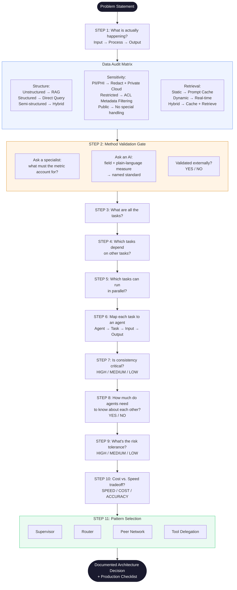

# Agentic Blueprint

A domain-agnostic 11-step framework for making architecture decisions 
before building any multi-agent AI system.

## The Problem It Solves

Most agentic systems are built before the architecture is understood. 
Agents get added, patterns get chosen, and guardrails get bolted on 
after the fact. This framework reverses that — every structural decision 
is made and documented before a single line of code is written.

## What This Framework Assumes

This framework governs process. It is process-agnostic across domains. It does not contain domain methodology.

It assumes the core metric or model has been validated externally, and forces that validation before proceeding.

The seam between process and domain is a contract, not a gap: this framework owns the process; the domain specialist owns the metric.

## What It Does

Takes any agentic AI problem and walks it through 11 structured steps 
to produce one documented architecture decision.

**Step 1 — Define what is actually happening**
Map input → process → output. Run the Data Audit Matrix across three axes:
- Structure: unstructured / structured / semi-structured → determines RAG vs direct query vs hybrid
- Sensitivity: PII/PHI / restricted / public → determines redaction, ACLs, or no special handling
- Retrieval: static / dynamic / hybrid → determines prompt caching vs real-time retrieval

**Step 2 — Method validation gate**
Step 1 audits the data. Step 2 audits the method. Validate the core metric or model with a domain specialist outside this framework before deciding anything. For an unfamiliar domain, ask an AI — give your field and what you measure in plain words — and require back:
- The domain's standard metric and its denominator / baseline / hidden assumption
- The named standard or body it comes from — verifiable, not a guess

This framework selects architecture. It does not supply domain methodology. A naive metric certified here is still naive.

**Steps 3, 4, 5 — Break down the work**
List every task. Map which tasks depend on each other. Identify what can run in parallel.

**Step 6 — Map tasks to agents**
Each agent gets one task, defined inputs, and defined outputs. No ambiguity.

**Step 7 — Consistency check**
Is inconsistency between agents acceptable? HIGH / MEDIUM / LOW with explicit reasoning.

**Step 8 — Agent interdependency**
Do agents need to know about each other's outputs? Defines information flow architecture.

**Step 9 — Risk tolerance**
What is the consequence of failure? LOW / MEDIUM / HIGH drives guardrail intensity.

**Step 10 — Cost vs Speed vs Accuracy**
Explicit tradeoff decision before any tool or model is chosen.

**Step 11 — Pattern selection**
One of four LangGraph patterns selected based on all steps above:
Supervisor / Router / Peer Network / Tool Delegation

### Visual Flow

## Output

A single documented architecture decision with:
- Data handling strategy
- Agent map with inputs and outputs
- Dependency and parallel execution windows
- Risk and consistency ratings
- Pattern selection with reasoning
- Production checklist: fallbacks · validation · tracing · retries · 
  monitoring · audit logs · compliance sign-off

## Applied To

Six production-grade agentic systems across Construction Tech, 
Healthcare, and FinTech. See portfolio links in profile.

## What Is Not In This Repo

The implementation — prompts, code, and system-specific logic — 
is not published here. This repo documents the decision framework only.
